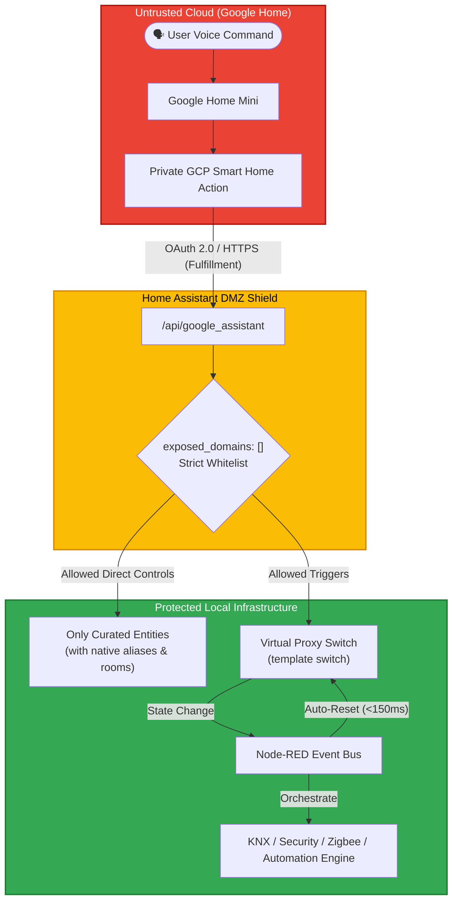
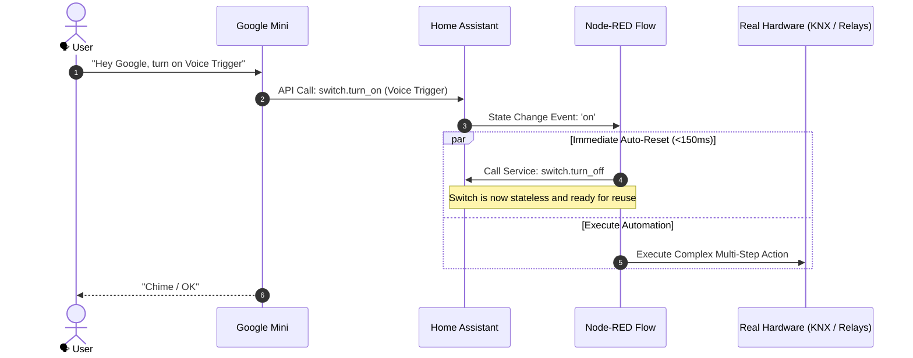

# Smart Home Voice DMZ: Zero-Exposure Google Assistant & Node-RED Architecture

[](LICENSE)
[](https://www.home-assistant.io/)
[](https://nodered.org/)
[](#the-smart-home-dmz-architecture)
[](#for-ai-coding-assistants)

A hardened, privacy-first blueprint for integrating **Google Assistant / Google Home Minis** with **Home Assistant** and **Node-RED** without exposing your internal devices, cameras, alarms, or network topology to Google Cloud, and without requiring Nabu Casa or manual Google Home routines.

---

## The Problem with Traditional Voice Integrations

Most official documentation and online tutorials instruct users to expose entire domains:
```yaml
# ❌ THE TRADITIONAL PRIVACY RISK:
google_assistant:
  exposed_domains:
    - light
    - switch
    - cover
    - climate
```

In a home with dozens or hundreds of circuits (KNX, Zigbee, Z-Wave, Lutron), security systems, cameras, and private sensors:
- **Google Cloud learns your daily habits:** Every motion sensor trip, camera status, door lock state, and light toggle is continuously synchronized to Google HomeGraph.
- **Entity pollution:** Hundreds of internal technical entities clutter your Google Home app.
- **Routine nightmare:** Users end up creating dozens of fragile manual routines in the Google Home app to map natural voice commands.

---

## The Solution: The Smart Home DMZ

This architecture treats Google Assistant as an **untrusted external input peripheral** situated in a Demilitarized Zone (DMZ):



### Key Principles
1. **Strict Zero-Exposure Whitelist (`exposed_domains: []`):** Google Cloud sees **only** what you explicitly define. Your internal topology, cameras, sensors, and alarms remain invisible.
2. **Virtual Proxy Event Bus:** Voice triggers activate stateless virtual template switches in Home Assistant that Node-RED listens to and resets in **<150ms**, ready for immediate reuse.
3. **Routine-Free Natural Language:** Native Home Assistant `aliases:` and `room:` definitions map speech directly inside Home Assistant, completely eliminating the need for manual Google Home app routines.

---

## Quick Reference: Dual-Audience Navigation

| I am a... | Recommended Path |
| :--- | :--- |
| 🧑‍💻 **Human Engineer** | Follow the step-by-step phases below: [Phase 1](#phase-1-google-cloud--actions-console-setup) through [Phase 5](#phase-5-troubleshooting--gotchas). |
| 🤖 **AI Coding Agent** (Claude, Cursor, Copilot) | Read the structured prompt at [docs/AGENT_INSTRUCTIONS.md](docs/AGENT_INSTRUCTIONS.md) and execute the configuration directly. |

---

## Prerequisites

Before starting, ensure you have:
- A Home Assistant instance accessible via public HTTPS with a valid SSL certificate (e.g. Cloudflare Tunnel, DuckDNS, NGINX SSL).
- A standard Google account.
- At least one Google Home Mini, Nest speaker, or the Google Home mobile app.
- Node-RED (optional, only needed if you plan to dispatch complex automations from voice).

---

## Phase 1: Google Cloud & Actions Console Setup

You do **not** need a paid Nabu Casa subscription or a published public Google Action to achieve native integration. You will create a private, self-hosted developer action in Test mode.

### Step 1.1: Create Project in Google Actions Console
1. Navigate to the [Google Actions Console](https://console.actions.google.com/).
2. Click **New Project** and name it (e.g. `ha-private-bridge`).
3. Select **Smart Home** as the project type and click **Start Building**.

### Step 1.2: Set Up Fulfillment URL
1. Under **Quick Setup**, click **Name your Smart Home action** (e.g. `HA Bridge`).
2. Under **Build your Action**, click **Add Action(s)**.
3. Enter your Home Assistant public HTTPS fulfillment URL:
   ```
   https://ha.yourdomain.com/api/google_assistant
   ```
   *(Must have a valid SSL certificate like Let's Encrypt / Cloudflare).*

### Step 1.3: Configure OAuth 2.0 Account Linking
Under **Advanced Options > Account Linking**:
- **Client ID**:
  ```
  https://oauth-redirect.googleusercontent.com/r/[YOUR_PROJECT_ID]
  ```
  *(Replace `[YOUR_PROJECT_ID]` with your exact Google Cloud project ID from Project Settings).*
- **Client Secret**: Any non-empty string (e.g. `placeholder_secret`).
- **Authorization URL**: `https://ha.yourdomain.com/auth/authorize`
- **Token URL**: `https://ha.yourdomain.com/auth/token`
- **Scopes**: `email` and `name` (press Enter after each).
- **Google to transmit clientID & secret via HTTP basic auth header**: Unchecked.

### Step 1.4: Service Account Key (For Local State Reporting)
1. Go to the [Google Cloud IAM & Admin Console](https://console.cloud.google.com/iam-admin/serviceaccounts) with your project selected.
2. Click **Create Service Account** (Name: `home-assistant`).
3. Assign the role: **Service Account Token Creator**.
4. Click into the new service account > **Keys** > **Add Key** > **Create new key (JSON)**.
5. Download the JSON file, rename it to `service_account.json`, and place it in the same directory as your YAML package file (e.g. `/config/packages/`).

### Step 1.5: Enable HomeGraph API & App Branding Requirement
1. In Google Cloud Console, go to **APIs & Services > Library** and search for **HomeGraph API**. Click **Enable**.
2. Go to **APIs & Services > OAuth consent screen**:
   - Set User Type to **External**.
   - Add your Google account email to **Test Users**.
3. In Actions Console > **Deploy > Directory information**:
   - Upload any square **144x144 PNG image** as the Small Icon (Google requires this before allowing Test deployment).
4. Click **Test > On device testing** to activate the simulator.

### Step 1.6: Link Account in the Google Home Mobile App
1. Open the **Google Home app** on your mobile phone.
2. Tap **Devices > Add (+) > Works with Google**.
3. Look for your action prefixed with `[test]` (e.g. `[test] HA Bridge`).
4. Tap it and log in with your Home Assistant user credentials.
5. Once authenticated, your whitelisted entities will appear instantly in the app.

---

## Phase 2: Home Assistant Hardened Package

Ensure packages are enabled in your `configuration.yaml`:
```yaml
homeassistant:
  packages: !include_dir_named packages
```

Then add the following package to `/config/packages/google_assistant_dmz.yaml` (with `service_account.json` in the same directory):

```yaml
# ------------------------------------------------------------------------------
# 1. Virtual Helper & Proxy Switch (Event Bus)
# ------------------------------------------------------------------------------
input_boolean:
  voice_event_bus:
    name: "Voice Event Bus"
    icon: mdi:microphone-message

template:
  - switch:
      - name: "Voice Trigger Event"
        unique_id: voice_trigger_event_dmz
        state: "{{ is_state('input_boolean.voice_event_bus', 'on') }}"
        turn_on:
          - action: input_boolean.turn_on
            target:
              entity_id: input_boolean.voice_event_bus
        turn_off:
          - action: input_boolean.turn_off
            target:
              entity_id: input_boolean.voice_event_bus

# ------------------------------------------------------------------------------
# 2. Hardened Google Assistant Configuration
# ------------------------------------------------------------------------------
google_assistant:
  project_id: my-voice-bridge-1234
  service_account: !include service_account.json
  report_state: true

  # STRICT ZERO-EXPOSURE: Empty list prevents automatic exposure of any real devices
  exposed_domains: []

  # Explicit Entity Whitelist
  entity_config:
    # Virtual trigger switch for Node-RED
    switch.voice_trigger_event:
      name: "Voice Trigger"
      aliases:
        - "voice trigger"
        - "trigger event"
      expose: true

    # Direct physical device with native aliases and room grouping
    light.living_room_ambient_light:
      name: "Living Room Lights"
      room: "Living Room"
      aliases:
        - "main lights"
        - "living room lights"
        - "ambient light"
      expose: true

    cover.living_room_blinds:
      name: "Living Room Blinds"
      room: "Living Room"
      aliases:
        - "roller blinds"
        - "window blinds"
      expose: true
```

---

## Phase 3: Node-RED Auto-Reset Pipeline

To trigger complex automations (e.g., exit modes, multi-room scenes, sequence dispatches) via voice without state lockup:

1. Import the template flow: [`templates/nodered/google_dmz_flow.json`](templates/nodered/google_dmz_flow.json).
2. The flow listens for `switch.voice_trigger_event` transitioning to `on`.
3. An `api-call-service` node immediately turns the switch back `off` (<150ms).
4. A downstream function/action node handles the business logic.



---

## Phase 4: Room Awareness Without Routines

Google Home supports **contextual room awareness** natively when configured properly:

1. In the Google Home app, assign your physical Google Home Mini to a room (e.g. `Office`).
2. Assign the Home Assistant entities exposed in that room to the same room (`room: "Office"`).
3. Now, whenever you speak to that specific Mini:
   - Saying **"Hey Google, turn on the lights"** will *only* turn on the lights in that room.
   - Saying **"Hey Google, close the blinds"** will *only* close the blinds in that room.
4. **Result:** You never have to create separate Google Home routines for each speaker or room.

---

## Phase 5: Troubleshooting & Gotchas

| Symptom / Error | Root Cause | Solution |
| :--- | :--- | :--- |
| **"Could not reach [test] HA Bridge"** on mobile app during linking | Client ID mismatch or incorrect OAuth URL | Ensure Client ID in Actions Console is strictly `https://oauth-redirect.googleusercontent.com/r/[YOUR_PROJECT_ID]`. |
| **Consent screen says "Giving access to [stray_username]"** | Stray Client ID was typed into the Actions Console | Reset Client ID to the standard redirect URL format above. |
| **Google says "That device isn't set up yet"** | HomeGraph is out of sync | In Home Assistant Developer Tools > Actions, call `google_assistant.request_sync`. |
| **Action Console Test deployment blocked** | Missing icon | Upload any 144x144 PNG under Deploy > Directory Information. |
| **HA Repair: "Deprecated switch platform"** | Using legacy `switch: - platform: template` | Update to modern template format: `template: - switch:`. |

---

## Repository Templates

- 📄 **Home Assistant Package:** [`templates/homeassistant/google_assistant_dmz.yaml`](templates/homeassistant/google_assistant_dmz.yaml)
- 📄 **Node-RED Flow:** [`templates/nodered/google_dmz_flow.json`](templates/nodered/google_dmz_flow.json)
- 📄 **Agent Automation Prompt:** [`docs/AGENT_INSTRUCTIONS.md`](docs/AGENT_INSTRUCTIONS.md)

---

## Contributing & License

Contributions, updates, and community suggestions are welcome via Pull Requests.
Distributed under the **MIT License**. See [LICENSE](LICENSE) for details.
